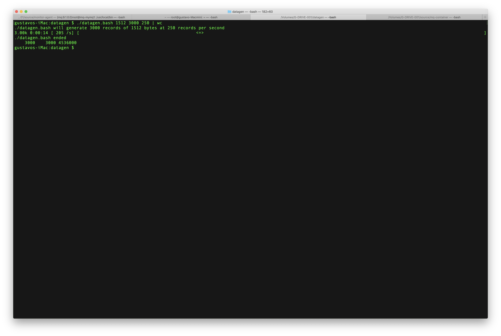
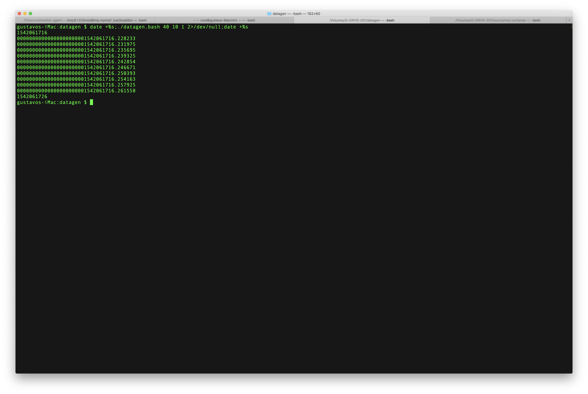

# datagen
##### Utility to create data records at a specific rate for testing purposes
## TL;DR
A tool to generate unique records of a given length and at a given rate expressed in
records per second. Comes in two basic flavors (a golang version is on the works),
a bash script, and a python program.
### The Linux way: datagen.bash
In order to use it, some prerequisite components are needed:
- Pipe Viewer tool (`pv`).
- For Mac OS X the gnu version of date (`gdate`) that can be installed using `brew install coreutils`.
Each data record generated has the specified length, ends with a '\n' newline character, and is composed
of a right-aligned, left-padded with zeroes, floating point number representing the Unix timestamp with nanosecond precision.

Usage:
```
datagen.bash [record_length|1024] [number_of_records|1000] [rate|100]
```
For instance, `./datagen.bash 1512 3000 250` will generate 3,000 records of 1,512 bytes (each record terminated by newline '\n') at 250 records per second:




#### Limitations of the Linux version
A couple of things worth noting: First, the rate is managed by the `pv` utility and is approximate at best.
Secondly, the records generated are paced by the `pv` utility, and the timestamp in the record does not match
the actual time it was released by pv to the downstream consumers. As you can see below, the timestamp of each record is only 5 milliseconds apart for this command:
```
date +%s;./datagen.bash 40 10 1 2>/dev/null;date +%s
```
where we can see that each record is actually passed every second, but their timestamps are almost consecutive at the moment they were generated.


### The Pythonic way: datagen.py
In order to use it you need, python!
```
usage: datagen.py [-h] [-n NUMBER] [-l LENGTH] [-j JITTERLEN] [-r RATE] [-f JITTERRATE]

optional arguments:
  -h, --help                                show this help message and exit
  -n NUMBER, --number NUMBER                number of records (default: 10)
  -l LENGTH, --length LENGTH                record length (default: 100)
  -j JITTERLEN, --jitterlen JITTERLEN       jitter in the record length (default: 0)
  -r RATE, --rate RATE                      record rate in records per second (default: 1)
  -f JITTERRATE, --jitterrate JITTERRATE    jitter in the record rate (default: 0)
```


## Background: What problem is datagen trying to solve?
Test data generation is an important part of the tasks a software engineer needs to face.
While there are many open source and commercial tools available that solve many of the
problems, developer still struggle with some (relatively) simple tasks.
This tool helps in the particular space of testing APIs and micro-services, as well as
queueing systems, from an infrastructure and middleware perspective.
The **datagen** tool has been designed to solve the problem of quickly generating
testing data at a particular rate (expressed as records or messages per second),
and with a particular distribution of record or message lengths. The tool follows
the principles of Unix, in the sense that it writes its output to STDOUT in order
for it to be fed into other programs in a simple, automated, and scripted manner.
